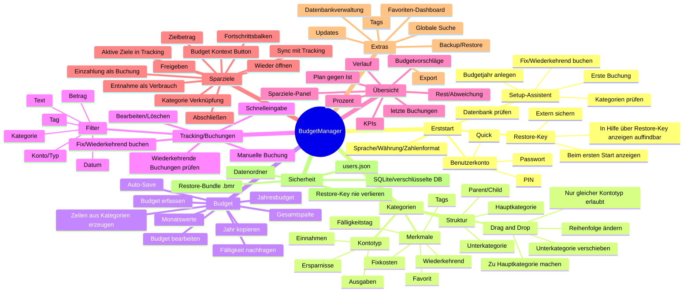

# BudgetManager Wissensdatenbank

## Cockpit / Startseite

Das Cockpit ist die ruhige Startseite: Es zeigt das Wichtigste, ohne die Fachreiter zu ersetzen. Es enthält Monatsstatus, Favoriten, aktive Sparziele, Budget-Ampel, offene Monatsbuchungen und die letzten 10 Buchungen.

**Warum Favoriten hier Sinn machen:** Favoriten sind Kategorien, die du regelmäßig kontrollieren willst. Im Cockpit bleiben sie sichtbar, ohne dass du jedes Mal in Budget oder Übersicht suchen musst.

**Frei gestaltbar:** Über `⚙ Cockpit gestalten` oder `Ansicht → Anzeigen → Cockpit-Bereiche` blendest du einzelne Cockpit-Karten ein oder aus. Über `Ansicht → Anzeigen → Reiter ein-/ausblenden` kannst du Hauptreiter ausblenden. Mindestens ein Reiter bleibt sichtbar, damit du dich nicht aussperrst.

**Empfohlener roter Faden:** Cockpit öffnen → Warnungen/offene Buchungen prüfen → bei Bedarf Buchung erfassen oder Fixkosten buchen → Budget/Sparziele/Übersicht nur öffnen, wenn Details nötig sind.

> Direkt anzeigbare Mindmap: `docs/help/mindmap.de.html`, `docs/help/mindmap.en.html`, `docs/help/mindmap.fr.html` (Browser) · Mermaid-Quellen: `docs/help/mindmap.de.mmd`, `docs/help/mindmap.en.mmd`, `docs/help/mindmap.fr.mmd`. `mindmap.html` und `mindmap.mmd` bleiben als deutsche Fallback-Dateien erhalten.


Stand: 19. Juni 2026  
Gültig für: BudgetManager 2.1.1

Diese Wissensdatenbank ist die zentrale Hilfe für Erstnutzer und für spätere Nachschlagefälle. Sie erklärt nicht nur einzelne Knöpfe, sondern den Ablauf: **Kategorien → Budget → Sparziele → Tracking/Buchungen → Übersicht → Backup/Restore**.

---

## Ergänzung v2.1.0 – Cockpit und Stabilität

- Das Cockpit zeigt zusätzlich Budgetwarnungen und bietet per Rechtsklick sinnvolle Schnellaktionen.
- Unter Wayland nutzt BudgetManager standardmäßig `xcb`, um bekannte Qt-TextInput-Abstürze zu vermeiden. Native Wayland-Nutzung ist mit `BM_ALLOW_WAYLAND=1` möglich.
- Diagramme und Übersetzungen wurden für die Release-Abnahme bereinigt.

## 0. Der wichtigste Ablauf in einem Satz

1. **Kategorien** sind deine Geld-Töpfe.  
2. **Budget** ist dein Plan pro Monat.  
3. **Tracking/Buchungen** sind echte Einträge.  
4. **Übersicht** vergleicht Plan gegen Ist.  
5. **Backup + Restore-Key** schützen deine Daten.

> Wichtig: Ein Budgetwert erzeugt keine Buchung. Buchungen entstehen manuell, über Schnelleingabe oder bewusst über **Tracking → Fix/Wiederkehrend buchen…**.

> Aktueller Standard: **Auto-Speichern** und **Auto-Backup** sind beim ersten Start eingeschaltet. Du arbeitest dadurch sicherer, auch wenn du das Programm einfach schließt.

---

## 1. Informations-Laufplan als Mindmap

### 1.1 Mermaid-Mindmap

Diese Mindmap kann in Markdown-Programmen mit Mermaid-Unterstützung direkt angezeigt werden.



### 1.2 Praktischer Laufplan für Menschen

```text
Start
  ↓
Benutzer anlegen → Restore-Key notieren → Sprache/Währung prüfen
  ↓
Kategorien prüfen/ordnen → Fixkosten/Wiederkehrend/Fälligkeit setzen
  ↓
Budgetjahr anlegen → Monatswerte eintragen oder Jahr kopieren
  ↓
Monatsanfang: Fix/Wiederkehrend buchen…
  ↓
Alltag: Schnelleingabe oder Tracking manuell pflegen
  ↓
Wöchentlich/monatlich: Übersicht prüfen, Budgetvorschläge kontrollieren
  ↓
Vor großen Änderungen: Backup erstellen
  ↓
Bei Problemen: Hilfe → Wissensdatenbank / Restore-Key anzeigen / Backup & Restore
```

---

## 2. Erster Start: was du in welcher Reihenfolge tun solltest

### 2.1 Benutzerkonto wählen

Beim ersten Start legst du ein Konto an. Es gibt drei Sicherheitsstufen:

| Modus | Vorteil | Nachteil | Empfehlung |
|---|---|---|---|
| Quick | Sehr einfach, kein Passwort | Schutz nur gegen Versehen/Neugier | Für lokale Tests okay |
| PIN | Schnell, aber geschützt | PIN + Restore-Key müssen gesichert sein | Guter Standard |
| Passwort | Stärkster Schutz | Passwort + Restore-Key müssen gesichert sein | Für echte private Daten empfohlen |

### 2.2 Restore-Key / Datenbank-Key

Beim ersten Start zeigt BudgetManager den **Restore-Key** an. Dieser Schlüssel ist notwendig, wenn du eine verschlüsselte Datenbank oder ein Backup wiederherstellen musst und normale Anmeldung/Benutzerdaten nicht mehr reichen.

**Sichere den Restore-Key extern:**

- Passwortmanager, zum Beispiel Bitwarden.
- Ausdruck in einem Ordner.
- Verschlüsselte Notiz.
- Nicht nur im gleichen BudgetManager-Ordner speichern.

> Ohne Restore-Key kann eine verschlüsselte Datenbank im Notfall unbrauchbar werden. Das ist bei echter Verschlüsselung normal und gewollt.

### 2.3 Restore-Key später wiederfinden

Im Programm:

```text
Hilfe → Restore-Key anzeigen…
```

oder:

```text
Konto → Konto verwalten → Restore-Key
```

Dort kannst du den Key anzeigen und kopieren.

### 2.4 Setup-Assistent

Der Setup-Assistent führt dich durch:

1. Datenbank prüfen oder zurücksetzen.
2. Kategorien prüfen.
3. Budgetjahr anlegen.
4. Erste Buchung erfassen.
5. Fix/Wiederkehrend buchen.

Du kannst ihn später erneut öffnen:

```text
Hilfe → Setup-Assistent
```

---

## 3. Datenbank, Datenordner und Backups

### 3.1 Was wird gespeichert?

BudgetManager nutzt SQLite. Je nach Modus gibt es eine normale oder verschlüsselte Datenbank.

Typische Daten:

| Bereich | Inhalt |
|---|---|
| categories | Kategorien, Parent/Child, Fixkosten, Wiederkehrend, Fälligkeitstag |
| budget | Budgetwerte pro Jahr, Monat, Typ und Kategorie |
| tracking | echte Buchungen / Einnahmen / Ausgaben / Ersparnisse |
| tags / entry_tags | Tags und Zuweisung zu Buchungen |
| favorites | Favoriten für schnelle Orientierung |
| savings_goals | Sparziele inklusive Status |
| recurring_transactions | vorbereitete wiederkehrende Buchungslogik |
| budget_warnings | Budgetwarnungen und Vorschläge |
| system_flags | Schema-Version und interne Zustände |
| undo_redo | Rückgängig/Wiederholen-Verlauf |

### 3.2 Datenordner öffnen

```text
Datei → Datenordner öffnen
```

Dort liegen Datenbank, Backups, Exporte und je nach Modus Benutzer-Metadaten.

### 3.3 Datenbank-Info

```text
Datei → Datenbank-Info
```

Zeigt dir unter anderem:

- Datenbankpfad,
- Tabellen,
- Jahre mit Budget,
- Jahre mit Tracking,
- Anzahl Einträge.

### 3.4 Backup

```text
Extras → Backup & Restore
```

Empfehlung: Backup erstellen vor:

- Update,
- Kategorien löschen,
- Import,
- Datenbank bereinigen,
- großer Umstrukturierung per Drag & Drop.

### 3.5 Restore-Bundle `.bmr`

`.bmr` ist das BudgetManager-Restore-Bundle. Es enthält die Datenbank für Wiederherstellung/Transport. Der Restore-Key wird bewusst **nicht** im Bundle gespeichert.

---

## 4. Kategorien: Grundstruktur

Kategorien sind die Grundstruktur des Programms. Jede Buchung und jedes Budget hängt an einer Kategorie.

### 4.1 Die drei Kontotypen

BudgetManager arbeitet mit mindestens drei Kontotypen:

| Typ | Zweck | Beispiele |
|---|---|---|
| Einnahmen | Geld kommt rein | Lohn, Bonus, Verkauf |
| Ausgaben | Geld geht raus | Miete, Lebensmittel, Krankenkasse |
| Ersparnisse | Geld wird zurückgelegt | Notgroschen, Ferien, Steuern |

### 4.2 Hauptkategorie und Unterkategorie

Beispiel:

```text
Ausgaben
  Wohnen
    Miete
    Strom
    Internet
```

`Wohnen` ist Parent/Hauptkategorie. `Miete`, `Strom`, `Internet` sind Child/Unterkategorien.

### 4.3 Wichtige Regeln

- Unterkategorien dürfen nur unter Kategorien desselben Typs hängen.
- Einnahmen-Kategorien dürfen nicht unter Ausgaben landen.
- Beim Löschen einer Parent-Kategorie werden Kinder hochgestuft, damit nichts verwaist.
- Umbenennen läuft zentral und zieht Budget, Tracking, Favoriten, Warnungen, wiederkehrende Buchungen und Sparziele mit.

---

## 5. Fixkosten, Wiederkehrend und Fälligkeitstag

### 5.1 Fixkosten-Häkchen

**Fixkosten** bedeutet: Diese Kategorie hat einen planbaren, eher festen Betrag.

Beispiele:

- Miete,
- Krankenkasse,
- Internet,
- Leasing,
- Versicherungen,
- Abos mit fixem Preis.

#### Das Fixkosten-Häkchen löst aus

- Kategorie erscheint bei **Tracking → Fix/Wiederkehrend buchen…**.
- Betrag kommt aus dem Budgetwert des gewählten Monats.
- Buchungsdatum kommt vom Fälligkeitstag der Kategorie.
- Ohne Fälligkeitstag wird der 1. des Monats genutzt.
- Bemerkung wird sinnvoll vorbelegt, zum Beispiel `Juni - Miete`.
- Bereits vorhandene Buchungen derselben Kategorie im Monat werden übersprungen.
- Budgetwert `0` wird nicht gebucht.
- Budgetvorschläge behandeln Fixkosten vorsichtiger.

#### Das Fixkosten-Häkchen löst nicht aus

- Keine automatische Zahlung.
- Keine stille Buchung im Hintergrund.
- Keine Buchung beim Programmstart.
- Keine automatische Budgetänderung.
- Keine Budgetsenkung nur wegen Monaten mit `0` Buchungen.

### 5.2 Wiederkehrend-Häkchen

**Wiederkehrend** bedeutet: Diese Kategorie kommt regelmäßig vor, der Betrag kann aber schwanken.

Beispiele:

- Lebensmittel,
- Hobby,
- Benzin,
- Haushalt,
- Kinderkosten.

Wiederkehrende Kategorien können im Fix/Wiederkehrend-Dialog vorgeschlagen werden, bleiben aber eher flexibel.

### 5.3 Fixkosten und Wiederkehrend zusammen

Wenn eine Kategorie beides hat, gilt sie praktisch als regelmäßig und planbar. BudgetManager verhindert Doppelbuchungen.

### 5.4 Fälligkeitstag

Der Fälligkeitstag bestimmt den Buchungstag im Monat.

Beispiele:

| Fälligkeitstag | Ergebnis |
|---|---|
| 1 | Monatsanfang |
| 15 | Monatsmitte |
| 28 | Ende vieler Monate sicher |
| 31 | In kurzen Monaten wird auf den Monatsletzten gekürzt |
| leer/kein Tag | BudgetManager nutzt 1. des Monats |

---

## 6. Drag & Drop: wo, wie, was

### 6.1 Kategorien-Manager

```text
Extras → Kategorien verwalten
```

oder direkt im **Budget**-Tab. Der frühere separate Kategorien-Tab (Experten-Modus) wurde entfernt – Kategorien verwaltest du jetzt über den Kategorie-Manager (`Strg+K`) und den Budget-Tab.

Mit Drag & Drop kannst du:

- Reihenfolge ändern,
- Unterkategorie unter andere Hauptkategorie ziehen,
- Kategorie zur Hauptkategorie machen,
- Struktur übersichtlicher machen.

Regeln:

- Nur innerhalb desselben Kontotyps.
- Keine Kategorie darf Kind von sich selbst werden.
- Keine Kreise/Endlosschleifen in der Hierarchie.
- Nach großen Änderungen speichern/übernehmen.

### 6.2 Budget-Reiter

Im Budget-Reiter ist Drag & Drop für die Struktur/Ansicht gedacht, damit du Budgetpositionen besser organisieren kannst. Die fachliche Wahrheit bleibt die Kategorie-Struktur.

Praktischer Ablauf:

1. Kategorien grob im Kategorien-Manager ordnen.
2. Budget-Reiter öffnen.
3. Budgetjahr laden.
4. Reihenfolge/Hierarchie prüfen.
5. Budgetwerte eintragen.
6. Speichern.

### 6.3 Tabs verschieben

Die Haupt-Reiter selbst sind verschiebbar. Damit kannst du deine Arbeitsreihenfolge anpassen, zum Beispiel:

```text
Budget → Tracking → Übersicht → Kategorien → Sparziele
```

Zurücksetzen:

```text
Extras → Tab-Reihenfolge zurücksetzen
```

---

## 7. Budget-Reiter

Der Budget-Reiter ist dein Planungsbereich.

### 7.1 Filter

Du kannst nach Jahr und Typ/Konto filtern.

- Jahr: bestimmtes Budgetjahr.
- Typ/Konto: Einnahmen, Ausgaben, Ersparnisse.

### 7.2 Budget erfassen

```text
Budget → Budget erfassen
```

Nutzen:

- neue Budgetwerte gezielt eintragen,
- Kategorie wählen,
- Monatsbeträge setzen,
- neue Kategorie bei Bedarf erstellen.

### 7.3 Budget bearbeiten

```text
Budget → Budget bearbeiten
```

Nutzen:

- bestehende Position ändern,
- Monatswerte korrigieren,
- Fix-/Wiederkehrend-Kontext beachten.

### 7.4 Zeilen aus Kategorien erzeugen

```text
Budget → Zeilen aus Kategorien erzeugen
```

Nutzen:

- wenn Kategorien schon existieren,
- aber im Budgetjahr noch keine Budgetzeilen stehen.

### 7.5 Jahr kopieren

```text
Budget → Jahr kopieren
```

Typischer Einsatz:

- 2026 aus 2025 vorbereiten,
- Kategorien übernehmen,
- Beträge übernehmen oder leer/angepasst starten.

### 7.6 Gesamtspalte

Die Gesamtspalte zeigt Jahreswerte. Wenn du dort schreibst, kann BudgetManager den Betrag auf Monate verteilen. Bei Parent-Zeilen ist Vorsicht nötig: Parent-Zeilen sind Zusammenfassungen, echte Planwerte gehören in die Unterkategorien.

### 7.7 Autosave

Autosave speichert Änderungen automatisch. Für Anfänger ist es bequem; bei großen Umbauten kann man bewusst manuell speichern.

### 7.8 Fälligkeit nachfragen

Wenn aktiv, fragt BudgetManager bei passenden Änderungen nach einem Fälligkeitstag. Das ist nützlich bei Fixkosten.

---

## 8. Tracking / Buchungen

Tracking ist die Liste echter Buchungen.

### 8.1 Manuelle Buchung

```text
Tracking → Hinzufügen…
```

Felder:

| Feld | Bedeutung |
|---|---|
| Datum | Wann war die Buchung? |
| Betrag | Betrag in deiner Währung |
| Konto/Typ | Einnahmen, Ausgaben oder Ersparnisse |
| Kategorie | Nur Kategorien des gewählten Typs |
| Bemerkung | Freitext, zum Beispiel Rechnung, Monat, Notiz |
| Tags | optionale Schlagworte |

### 8.2 Speichern und weitere hinzufügen

In der Schnelleingabe/Tracking-Erfassung ist diese Arbeitsweise gedacht für mehrere Buchungen hintereinander. Die letzte Konto/Kategorie-Auswahl bleibt möglichst erhalten, damit du schneller buchen kannst.

### 8.3 Fix/Wiederkehrend buchen

```text
Tracking → Fix/Wiederkehrend buchen…
```

Ablauf:

1. Buchungsmonat wählen.
2. BudgetManager sammelt Kategorien mit Fixkosten/Wiederkehrend.
3. Beträge werden aus Budget oder Vorschlagslogik übernommen.
4. Bereits vorhandene Buchungen im Monat werden übersprungen.
5. Du prüfst die Liste.
6. Du bestätigst bewusst.

### 8.4 Filter im Tracking

Möglich sind Filter nach:

- Konto/Typ,
- Kategorie,
- Datum,
- Betrag,
- Bemerkung/Text,
- Tag,
- nur letzte X Tage.

### 8.5 Bearbeiten und Löschen

Buchungen kannst du bearbeiten oder löschen. Nach Änderungen aktualisiere die Übersicht, falls sie nicht automatisch neu geladen wurde.

---


## 8A. Sparziele im roten Faden

Sparziele liegen bewusst **zwischen Budget und Buchungen**:

```text
Budget = Plan: Ich will für etwas sparen.
Tracking/Buchungen = Realität: Ich habe Geld auf dieses Ziel gelegt oder wieder entnommen.
Übersicht = Kontrolle: Bin ich auf Kurs?
```

### Wo findest du Sparziele?

| Ort | Zweck | Sichtbarkeit |
|---|---|---|
| Budget → 🎯 Sparziele | Ziel planen, weil es zum Budget gehört | kleiner Button, nicht störend |
| Tracking/Buchungen → Aktive Sparziele | Fortschritt beim Buchen sehen | nur sichtbar, wenn aktive Ziele existieren |
| Übersicht → Sparziele | Monats-/Gesamtfortschritt kontrollieren | Teil der Auswertung |
| Extras → Sparziele | vollständige Verwaltung | immer verfügbar |
| Ansicht → Zu Sparziele | direkt zum Sparziel-Reiter springen | Tastatur/Navigation |

### Workflow

1. **Sparziel anlegen** – Name, Zielbetrag, optional Zieldatum.
2. **Kategorie verknüpfen** – idealerweise eine Kategorie unter *Ersparnisse*, z. B. `Notgroschen`.
3. **Einzahlung buchen** – im Tracking als Typ *Ersparnisse* mit positiver Summe.
4. **Fortschritt prüfen** – Tracking zeigt aktive Ziele kompakt mit Balken; Übersicht zeigt die Gesamtsicht.
5. **Freigeben** – wenn das Ziel erreicht/verwendbar ist. Der Betrag wird eingefroren.
6. **Geld herausbuchen** – im Tracking eine **Ersparnisse-Buchung mit negativem Betrag** auf die Ziel-Kategorie erfassen, z. B. `-500 CHF`.
7. **Abschließen** – wenn das Ziel erledigt oder verbraucht ist.

**Wichtig zu negativen Beträgen:** Negative Beträge sind nicht grundsätzlich gesperrt. Bei **Ausgaben** sind sie bewusst blockiert, damit Ausgaben nicht versehentlich falsch herum erfasst werden. Bei **Ersparnisse** sind negative Beträge erlaubt und bedeuten: *Geld aus einem Sparziel / einer Ersparnis herausnehmen*.

**Grenzen:** BudgetManager lässt den Sparziel-Stand nicht mehr unter **0** fallen und nicht über **100 %** steigen. Wenn du mehr entnehmen willst, als im Sparziel vorhanden ist, oder mehr einzahlen willst als bis zum Zielbetrag fehlt, wird die Buchung blockiert und du bekommst eine Meldung.

**Warum so?** Dadurch bleibt das Budget sauber: Das Ziel ist geplant, aber echte Bewegungen entstehen erst durch Buchungen.

## 9. Übersicht / Dashboard

Die Übersicht beantwortet: **Wie steht mein Plan im Vergleich zu meinen echten Buchungen?**

### 9.1 Filter

| Filter | Bedeutung |
|---|---|
| Jahr | bestimmtes Jahr oder gesamter Zeitraum |
| Monat | bestimmter Monat oder gesamtes Jahr |
| Typ | Einnahmen/Ausgaben/Ersparnisse |
| Kategorie | Detailauswertung |
| Tags/Text/Betrag | Drilldown in Buchungen |

### 9.2 Plan gegen Ist

Typische Spalten:

| Spalte | Bedeutung |
|---|---|
| Budget | geplanter Betrag |
| Gebucht/Getracked | tatsächliche Buchungen |
| Rest | Budget minus Buchungen |
| Prozent | Verbrauch/Erfüllung in Prozent |

### 9.3 Diagramme in der Übersicht

Die Übersicht nutzt Diagramme nur dort, wo sie eine Entscheidung leichter machen. Zu viele Kreisdiagramme werden bewusst vermieden.

| Diagramm | Wofür es gut ist | Wann du es nutzt |
|---|---|---|
| Übersicht / Donut | Schneller Plan-Ist-Status nach Einnahmen, Ausgaben und Ersparnissen | Monatscheck: Ist mein Budget grundsätzlich im Rahmen? |
| Kategorien | Ausgabenanteile je Kategorie | Herausfinden, welche Kategorie den größten Anteil hat |
| Verteilung | Einnahmen/Ausgaben/Ersparnisse im Verhältnis | Grober Gesamtblick auf Geldflüsse |
| Monatsverlauf | Ausgaben: Budget vs. gebucht pro Monat | Erkennen, ob Ausgaben dauerhaft steigen oder nur ein Ausreißer vorliegt |
| Monatsbilanz | Einnahmen minus Ausgaben, echt vs. geplant | Prüfen, ob am Monatsende genug übrig bleibt |
| Top-Buchungen | Die 5 größten Buchungen im gewählten Zeitraum | Einzelne große Ausreißer schnell finden |

Best Practice: Erst **Monatsverlauf** ansehen, dann bei Auffälligkeit in **Top-Buchungen** oder **Kategorien** nachsehen.

### 9.4 Letzte Buchungen und Verlauf

Die Übersicht zeigt aktuelle Bewegungen und Verlauf. Das hilft dir, schnell Ausreißer zu finden.

### 9.5 Budgetvorschläge

Budgetvorschläge sind Hinweise, keine Pflichtänderungen.

Grundregel:

- Flexible Kategorien dürfen aus Verhalten lernen.
- Fixkosten werden konservativ behandelt.
- `0` darf bei Fixkosten nie allein ein Senkungsgrund sein.
- Es braucht echte Buchungsmonate mit Betrag größer 0.

---

## 10. Sparziele: wann, wie, wo

### 10.1 Wo finde ich Sparziele?

```text
Reiter → Sparziele
```

oder:

```text
Extras → Sparziele
```

### 10.2 Wofür sind Sparziele?

Sparziele sind für Geld, das du bewusst zurücklegen möchtest.

Beispiele:

- Notgroschen,
- Ferien,
- Steuern,
- Hochzeit,
- neues Gerät,
- Autoreparatur.

### 10.3 Ein Sparziel anlegen

Typische Felder:

| Feld | Bedeutung |
|---|---|
| Name | Name des Ziels |
| Zielbetrag | Was willst du erreichen? |
| Aktueller Betrag | Was ist schon angespart? |
| Deadline | optionales Zieldatum |
| Kategorie | Verknüpfung mit Ersparnis-Kategorie |
| Notizen | zusätzliche Erklärung |

### 10.4 Fortschritt hinzufügen

```text
Sparziele → Fortschritt hinzufügen
```

Erhöht den aktuellen Betrag des Sparziels.

### 10.5 Sync mit Tracking

Die Sync-Funktion kann Sparziel-Stände aus passenden Buchungen ableiten bzw. abgleichen. Sie ist besonders nützlich, wenn du Ersparnisse konsequent als Tracking-Buchungen erfasst.

Empfohlene Praxis:

1. Ersparnis-Kategorie erstellen, zum Beispiel `Hochzeit`.
2. Sparziel mit dieser Kategorie verknüpfen.
3. Sparbuchungen im Tracking mit Typ `Ersparnisse` erfassen.
4. Sparziel synchronisieren.

### 10.6 Freigeben

Freigeben bedeutet: Das angesparte Geld darf jetzt verwendet werden. Der aktuelle Stand wird dabei eingefroren. Ab diesem Zeitpunkt erkennt BudgetManager negative Ersparnisse-Buchungen auf dieselbe Kategorie als Verbrauch dieses Sparziels.

Beispiel:

- Du hast 1'000 CHF für Ferien angespart.
- Die Ferien werden bezahlt.
- Du gibst das Sparziel frei.
- Danach buchst du die Zahlung als negative Ersparnisse-Buchung.

### 10.7 Geld aus einem Sparziel herausbuchen

So buchst du angespartes Geld aus einem Sparziel heraus:

1. Öffne `Sparziele`.
2. Wähle das passende Sparziel aus, z. B. `Ferien` oder `Hochzeit`.
3. Klicke auf `Freigeben`.
4. Gehe zu `Tracking / Buchungen`.
5. Erstelle eine neue Buchung.
6. Wähle als Typ/Konto `Ersparnisse`.
7. Wähle die Kategorie, die mit dem Sparziel verknüpft ist, z. B. `Hochzeit`.
8. Trage den Betrag **negativ** ein, z. B. `-500 CHF`.
9. Speichere die Buchung.

BudgetManager behandelt diese negative Ersparnisse-Buchung als Entnahme aus dem freigegebenen Sparziel.

**Ist eine negative Zahl gesperrt?** Nein, nicht für Ersparnisse. Im normalen Buchungsdialog und in der Schnellerfassung sind negative Beträge für `Ersparnisse` erlaubt. Bei `Ausgaben` bleiben negative Beträge gesperrt, weil Ausgaben immer positiv erfasst werden sollen.

**Wichtig:** Du kannst aber nicht mehr aus einem Sparziel herausbuchen, als aktuell darin vorhanden ist. Beispiel: Stand `300 CHF`, Entnahme `-500 CHF` → wird blockiert. Ebenso kannst du nicht über 100 % einzahlen. Beispiel: Ziel `1'000 CHF`, Stand `900 CHF`, Einzahlung `200 CHF` → wird blockiert. In beiden Fällen zeigt BudgetManager eine verständliche Meldung.

**Nicht verwechseln:** Wenn du Geld aus einem Sparziel verwendest, buchst du es nicht als normale Ausgabe, sondern als negative Buchung auf die passende Ersparnisse-Kategorie. Die eigentliche Ausgabe kann zusätzlich separat gebucht werden, wenn du sie in deiner Ausgabenstatistik sehen möchtest.

### 10.8 Abschließen

Abschließen bedeutet: Ziel ist erledigt. Es bleibt dokumentiert, wird aber nicht mehr als aktives Sparziel behandelt.

### 10.9 Wieder öffnen

Wenn ein Ziel fälschlich abgeschlossen wurde oder weiterlaufen soll, kannst du es wieder öffnen.

---

## 11. Favoriten: wofür ist das gut?

### 11.1 Zweck

Favoriten sind Kategorien, die du besonders häufig brauchst. Sie helfen, wichtige Kategorien schneller zu sehen und im Dashboard hervorzuheben.

Beispiele:

- Lebensmittel,
- Miete,
- Lohn,
- Krankenkasse,
- Hochzeit,
- Steuern.

### 11.2 Wo finde ich Favoriten?

```text
Extras → Favoriten
```

Shortcut:

```text
F12
```

### 11.3 Wann nutzen?

Nutze Favoriten für Kategorien, die du regelmäßig kontrollierst. Nicht jede Kategorie sollte Favorit sein, sonst verliert das Dashboard seinen Nutzen.

Gute Regel:

```text
Maximal 5–10 Favoriten pro Kontotyp
```

---

## 12. Tags

Tags sind flexible Schlagworte zusätzlich zur Kategorie.

Beispiele:

- Urlaub,
- Arzt,
- Kind,
- Rückerstattung,
- Barzahlung,
- Online,
- Projekt Hochzeit.

Kategorie beantwortet: **Was ist es?**  
Tag beantwortet: **In welchem Kontext steht es?**

Beispiel:

```text
Kategorie: Lebensmittel
Tag: Geburtstag
```

---

## 13. Globale Suche

```text
Extras → Globale Suche
```

oder Shortcut:

```text
Ctrl+F
```

Nutzen:

- Buchungen finden,
- Kategorien finden,
- Bemerkungen durchsuchen,
- schnell zum passenden Tab springen.

---

## 14. Schnelleingabe

```text
Extras → Schnelleingabe
```

oder Shortcut:

```text
Ctrl+N
```

Gut für Alltag:

- Einkauf erfassen,
- Lohn erfassen,
- kleine Ausgabe schnell buchen,
- mehrere Buchungen nacheinander.

---

## 15. Export

```text
Extras → Export
```

Nutzen:

- Daten extern sichern,
- Auswertungen weitergeben,
- Excel/CSV-Weiterverarbeitung,
- Kontrollbericht erstellen.

Vor großen Änderungen ist ein Backup wichtiger als Export, weil ein Backup für Wiederherstellung gedacht ist.

---

## 16. Datenbankverwaltung

```text
Extras → Datenbankverwaltung
```

Typische Funktionen:

- Integrität prüfen,
- Datenbank bereinigen,
- Tabellenstatistiken ansehen,
- Datenbank zurücksetzen.

Vorsicht:

- Vor Bereinigung oder Reset immer Backup erstellen.
- Reset löscht Daten.

---

## 17. Updates

```text
Extras → Updates…
```

Ablauf:

1. Update prüfen.
2. Manifest/lates.json lesen.
3. Download vorbereiten.
4. Integrität prüfen.
5. Update stagen.
6. Installation starten.

Unter Windows kann die laufende EXE sich nicht selbst überschreiben. Deshalb wird ein Helferprozess verwendet.

---

## 18. Einstellungen, Ansicht und Themes

### 18.1 Einstellungen

```text
Datei → Einstellungen
```

Typische Bereiche:

- Sprache,
- Währung,
- Zahlenformat,
- Fensterverhalten,
- Verhalten beim Speichern,
- Übersicht-Anzeige,
- Expertenfunktionen.

### 18.2 Ansicht

```text
Ansicht → …
```

Hier kannst du Tabs ein-/ausblenden, Tab-Position ändern und die Übersicht anpassen.

### 18.3 Themes

Themes ändern Farben und Lesbarkeit. Für Release wichtig: Keine Funktion darf nur über Farbe verständlich sein; Text/Icons müssen Bedeutung ebenfalls tragen.

---

## 19. Tastenkürzel

```text
Hilfe → Tastenkürzel
```

oder:

```text
Ctrl+F1
```

Wichtige Kürzel:

| Kürzel | Funktion |
|---|---|
| F1 | Wissensdatenbank |
| Ctrl+F1 | Tastenkürzel |
| Ctrl+S | Speichern |
| Ctrl+N | Schnelleingabe |
| Ctrl+F | Globale Suche |
| Ctrl+K | Kategorien verwalten |
| Ctrl+T | Tags verwalten |
| Ctrl+U | Updates |
| F12 | Favoriten |
| F5 | Aktualisieren |

---

## 20. Kategorie löschen: sichere Entscheidung

Beim Löschen kann BudgetManager abhängig von Daten fragen, was passieren soll.

Möglichkeiten:

| Option | Bedeutung |
|---|---|
| Nur Kategorie entfernen | wenn keine abhängigen Daten existieren |
| Daten löschen | Budget/Tracking/Favoriten etc. werden entfernt |
| Bis letztes Buchungsdatum | historische Daten bleiben kontrolliert erhalten/werden berücksichtigt |
| Umhängen | Daten werden einer anderen Kategorie zugeordnet |
| Parent löschen | Kinder werden hochgestuft |

Empfehlung: Wenn du unsicher bist, erst **Backup erstellen**, dann löschen.

---

## 21. Budget Buchungen Übersicht: Datenfluss verstehen

```text
Kategorie
  ↓
Budgetwert pro Monat
  ↓
Tracking-Buchung
  ↓
Übersicht rechnet Plan/Ist
  ↓
Budgetvorschlag oder Warnung
```

Beispiel:

```text
Kategorie: Ausgaben → Lebensmittel
Budget Juni: 400 CHF
Tracking Juni: 450 CHF
Übersicht: 50 CHF über Budget, 112.5 % genutzt
```

Bei Fixkosten:

```text
Kategorie: Ausgaben → Miete, Fixkosten, Fälligkeit 1
Budget Juni: 1410 CHF
Tracking → Fix/Wiederkehrend buchen…
Ergebnis: Buchung am 01.06., wenn noch keine Miete im Juni existiert
```

---

## 22. Typische Stolperfallen

### 22.1 „Ich habe Budget eingetragen, aber keine Buchung erscheint“

Richtig so. Budget ist nur Plan. Für Buchungen nutze Tracking oder Fix/Wiederkehrend buchen.

### 22.2 „Fixkosten wurden nicht gebucht“

Prüfe:

- Fixkosten-Häkchen gesetzt?
- Budgetwert im Monat größer 0?
- Bereits Buchung in diesem Monat vorhanden?
- Richtigen Monat gewählt?
- Kategorie unter richtigem Typ?

### 22.3 „Der Tag im Fixkosten-Dialog wurde nicht benutzt“

Der Dialog wählt den Monat. Das echte Buchungsdatum kommt vom Fälligkeitstag der Kategorie.

### 22.4 „Budgetvorschlag senkt Fixkosten nicht wegen 0-Monaten“

Absicht. Bei Fixkosten darf `0` nie allein der Grund für eine Budgetsenkung sein.

### 22.5 „Ich finde Restore-Key nicht“

Nutze:

```text
Hilfe → Restore-Key anzeigen…
```

oder:

```text
Konto → Konto verwalten
```

### 22.6 „Ich finde eine Funktion nicht“

Nutze:

- F1 Wissensdatenbank,
- Ctrl+F1 Tastenkürzel,
- Extras-Menü,
- Rechtsklick auf Tabellen,
- Setup-Assistent erneut starten.

---

## 23. Best Practice für Anfänger

### Täglich

- Neue Buchungen kurz erfassen.
- Schnelleingabe nutzen.

### Wöchentlich

- Tracking filtern und prüfen.
- Übersicht ansehen.

### Monatlich

- Fix/Wiederkehrend buchen.
- Budgetübersicht prüfen.
- Sparziele aktualisieren.
- Backup erstellen.

### Vor Änderungen

- Backup erstellen.
- Nur eine große Änderung auf einmal.
- Danach Übersicht prüfen.

---

## 24. Mini-Lexikon

| Begriff | Bedeutung |
|---|---|
| Kategorie | Geldtopf, an dem Budget und Buchungen hängen |
| Typ/Konto | Einnahmen, Ausgaben oder Ersparnisse |
| Parent | Hauptkategorie |
| Child | Unterkategorie |
| Budget | geplanter Betrag |
| Tracking | echte Buchungen |
| Fixkosten | planbarer fester Betrag |
| Wiederkehrend | regelmäßiger, ggf. variabler Eintrag |
| Fälligkeitstag | vorgeschlagener Buchungstag im Monat |
| Favorit | wichtige Kategorie für schnellen Zugriff |
| Tag | flexibles Schlagwort |
| Sparziel | Zielbetrag zum Ansparen |
| Freigeben | angespartes Geld wieder verfügbar machen |
| Abschließen | Sparziel als erledigt markieren |
| Restore-Key | Notfallschlüssel für verschlüsselte DB/Backup |
| `.bmr` | BudgetManager-Restore-Bundle |
| Staging | vorbereitetes Update, noch nicht angewendet |
| DAU-Test | Erstnutzer-Test ohne Spezialwissen |
```

---

## Ergänzung — Cockpit-Bugfix

### Erststart und Datenbankmeldung

Beim ersten Start zeigt BudgetManager nur noch eine einfache Erfolgsmeldung **„Datenbank erstellt“**. Die technischen Migrationsdetails bleiben über den Detailbereich erreichbar, sollen Einsteiger aber nicht mehr erschlagen.

Die Sprachwahl übersetzt ihre Regionseinstellungen jetzt live. Wenn du English oder Français auswählst, werden Währung, Zahlenformat, bevorzugter Tag und Hinweistext direkt in dieser Sprache angezeigt.

### Kategorieauswahl in Tracking und Schnelleingabe

Die Kategorieauswahl ist jetzt bewusst nach **Hauptkategorie → Unterkategorie** gruppiert. Sie wird nicht mehr automatisch nach Nutzungshäufigkeit umsortiert, weil das bei vielen Kategorien den roten Faden zerstört.

Best Practice:

1. Zuerst den Typ wählen: Einnahmen, Ausgaben oder Ersparnisse.
2. Dann Kategorie suchen oder aus der gruppierten Liste wählen.
3. Tippen filtert die Liste nach enthaltenem Text.

Ein späteres Nutzungsranking ist sinnvoll, sollte aber als eigene Option kommen, damit die Baumstruktur nicht verloren geht.

### Diagrammfarben

Diagramme verwenden jetzt den Kontotyp als Grundfarbe:

- Einnahmen: grün
- Ausgaben: rot
- Ersparnisse: blau

Bei Top-Buchungen erkennt man dadurch sofort, ob ein großer Balken Einkommen, Ausgabe oder Ersparnis ist.


## Cockpit gestalten: sichtbar und sortierbar

Das Cockpit ist die Startseite für den Alltag. Über **⚙ Cockpit gestalten** kannst du nicht nur Bereiche ein- und ausblenden, sondern auch die Reihenfolge ändern. Best Practice:

1. **Monatsstatus** ganz oben lassen.
2. Danach **Favoriten** oder **Offene Monatsbuchungen**, je nachdem was du häufiger kontrollierst.
3. **Letzte 10 Buchungen** eher weiter unten lassen, weil es ein Kontrollblock ist.

Ein Rechtsklick auf freie Flächen im Programm zeigt dir zusätzlich die passenden Aktionen aus dem Menü **Bearbeiten**. Tabellen können weiterhin eigene Spezialmenüs haben.

## Zahltag am 25.: Kalender-Monat oder Finanz-Monat?

Du siehst das richtig: Wenn dein Lohn am 25. kommt, ist dieses Geld in der Praxis meistens für den **folgenden Lebensmonat** gedacht. Es gibt zwei saubere Denkweisen:

- **Kalender-Monat:** Auswertungen laufen vom 1. bis Monatsende. Das ist einfacher und passt zu Rechnungen, Steuern und Exporten.
- **Finanz-Monat / Zahltags-Monat:** Du planst z. B. vom 25. bis zum 24. des Folgemonats. Das passt besser zum echten Geldfluss.

Aktuell bleibt BudgetManager bewusst beim Kalender-Monat. Der bevorzugte Tag für wiederkehrende Buchungen steuert Fälligkeiten, ist aber noch keine vollständige Budgetperiode 25.–24. Eine echte Zahltags-Budgetperiode sollte später als eigene Einstellung umgesetzt werden, damit Auswertung, Cockpit, Budget-Ampel, Fixkosten und Exporte dieselbe Logik verwenden.


---

## Ergänzung — Aufgeräumt

Der separate **Kategorien-Tab (Experten-Modus)** wurde entfernt, da redundant. Kategorienverwaltung läuft jetzt über den **Kategorie-Manager** (`Strg+K`, Menü Extras → Kategorien verwalten) und direkt im **Budget**-Tab (inkl. Drag & Drop). Die Settings-Option „separaten Kategorien-Tab anzeigen" entfällt.

